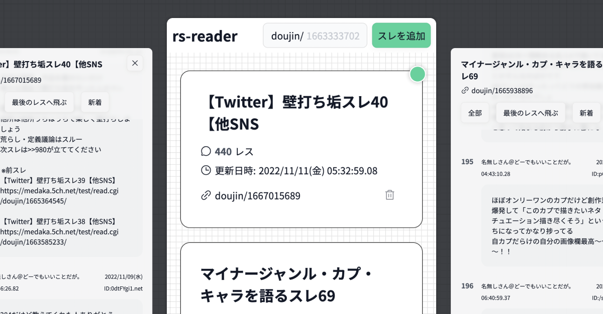

# Rs-Reader



Site to read and keep up with 2chsc art forum (doujin board) threads in one place.

[Visit the site](https://emhng.github.io/rs-reader/)

## Running Locally

NOTE: You will also need to host the [API](https://github.com/emhng/reader-api) locally

1.  Download the repo by clicking Code -> Download Zip
2.  Unzip the folder and then using your IDE of choice (i.e. VSCode), open the folder
3.  Run the following command

```
npm install
```

4. Replace the code inside of next.config.js with the following:

```
/** @type {import('next').NextConfig} */
const nextConfig = {
  reactStrictMode: true,
  swcMinify: true
}

module.exports = nextConfig
```

5. Create a .env.local with the following:

```
NEXT_PUBLIC_API = "http://localhost:8080/v1/"
NEXT_PUBLIC_STARTER_THREADS = "1663333702, 1665938896, 1667015689"
```

You can change what starter threads your local version starts with on first load, just make sure that thread IDs are followed by a , and a space.

6. Then run the following command to start the server:

```
npm run dev
```

The site should now be accessible from localhost:3000
